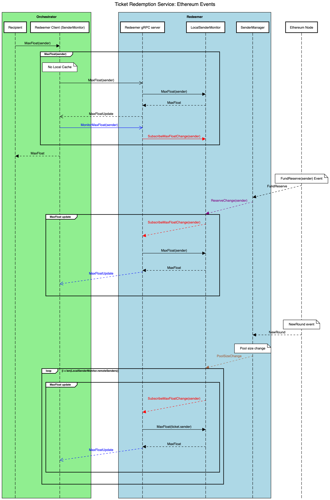

# Ticket Redemption Service

The Ticket Redemption Service allows Orchestrator nodes to redeem winning tickets on-chain using a separate ETH account on the Ticket Redemption Service. Orchestrator nodes no longer need to have an account funded with ETH to pay for transactions on the Ethereum network.

It is responsible for redeeming winning tickets as well as pushing _max float_ updates about broadcasters back to its connected Orchestrators.

_Max float_ is the guaranteed value an Orchestrator will be able from a Broadcaster's reserve. It accounts for the current reserve allocation from a Broadcaster to an Orchestrator as well as pending winning ticket redemptions. 

## TicketQueue

1. The `ticketQueue` is a loop that runs everytime a new block is seen. It will then pop tickets off the queue starting with the oldest ticket first, and sends it to the `LocalSenderMonitor` for redemption if the `recipientRand` for the ticket has expired. 

2. When the `LocalSenderMonitor` receives a ticket from the `ticketQueue` it will substract `ticket.faceValue` from the outstanding `maxFloat` as long as the ticket is in limbo. 

&nbsp;&nbsp;&nbsp;&nbsp;&nbsp;&nbsp;&nbsp;&nbsp;&nbsp;&nbsp; _This will trigger a `LocalSenderMonitor.SubscribeMaxFloatChange(ticket.sender)` notification_

3. The ticket is sent to a remote Ethereum node for redemption

4. When the Ethereum node returns a response the `ticket.faceValue` is added to the `maxFloat` again as the ticket is no longer in limbo.

&nbsp;&nbsp;&nbsp;&nbsp;&nbsp;&nbsp;&nbsp;&nbsp;&nbsp;&nbsp; _This will trigger a `LocalSenderMonitor.SubscribeMaxFloatChange(ticket.sender)` notification_

## Monitoring Max Float

1. When max float for a `sender` is requested from the `RedeemerClient` but no local cache is available, an (unary) RPC call will be sent to the `RedeemerServer`. 

2. A second RPC call to `MonitorMaxFloat(sender)` will open up a server-side gRPC stream to receive future update. 

_If this call fails the response from step 1 is returned, but not kept in cache to prevent duplicate streams_

3. The `RedeemerServer` go-routine started by the RPC call in step 2 will start a subscription to listen for max float changes from the `LocalSenderMonitor` for the specified `sender` using `LocalSenderMonitor.SubscribeMaxFloatChange(sender)`.

_Each open server-side stream will have its own subscription that will be closed when the client closes the stream. This means that each client will have a subscription for each sender it is interested in._ 

4. Once the subscription from step 3 emits an event that indicates a state change for the specified `sender`, the `RedeemerServer` will invoke `LocalSenderMonitor.MaxFloat(sender)` to fetch the latest value. 

5. Upon retrieving the latest max float value for `sender` it will be sent over the server-side gRPC stream.

6. Upon receiving a `MaxFloatUpdate` over the server-side gRPC stream for `sender` it will update its local cache for that `sender` accordingly. 

7. Subsequent calls to `RedeemerClient.MaxFloat(sender)` will return the locally cached value for `sender` as long as it remains available. 

8. The local cache for `sender` will be cleaned up if is not requested for 5 minutes. 

## Blockchain Events

So far we've discussed `LocalSenderMonitor.addFloat()` and `LocalSenderMonitor.subFloat()` being responsible for triggering `LocalSenderMonitor.SubscribeMaxFloatChange(sender)` notifications, but these can also be triggered by certain Ethereum events related to the Livepeer protocol: 

- FundReserve: When a broadcaster funds it's reserve the `maxFloat` allocation increases by the added reserve divided by the active Orchestrator set size.
- NewRound: If the active Orchestrator set size changes, the `maxFloat` will become the current broadcaster's reserve divided by the new active set size. Since this event impacts all participants in the protocol the `Redeemer` will have to send updates for _every_ `sender` it is keeping track of. 

